# 🐱 CatLover App [app link](https://github.com/yn864/cat_tinder_/releases/tag/v.1.0.0)

Приложение для любителей котиков с возможностью лайков, фильтрации и детальным просмотром пород

  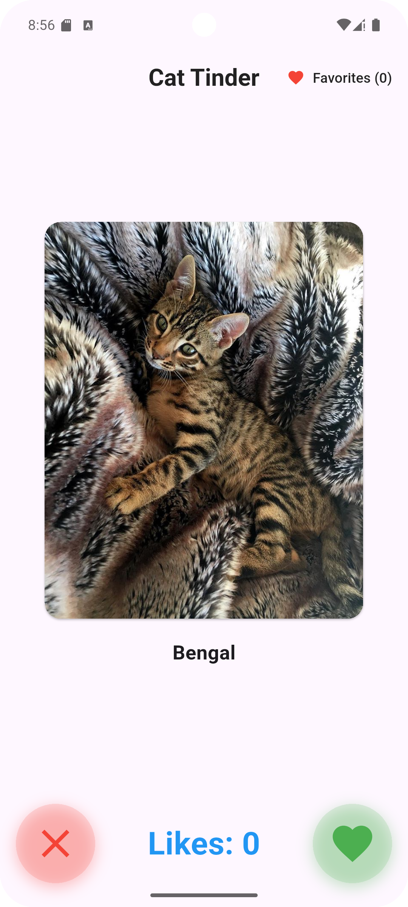
  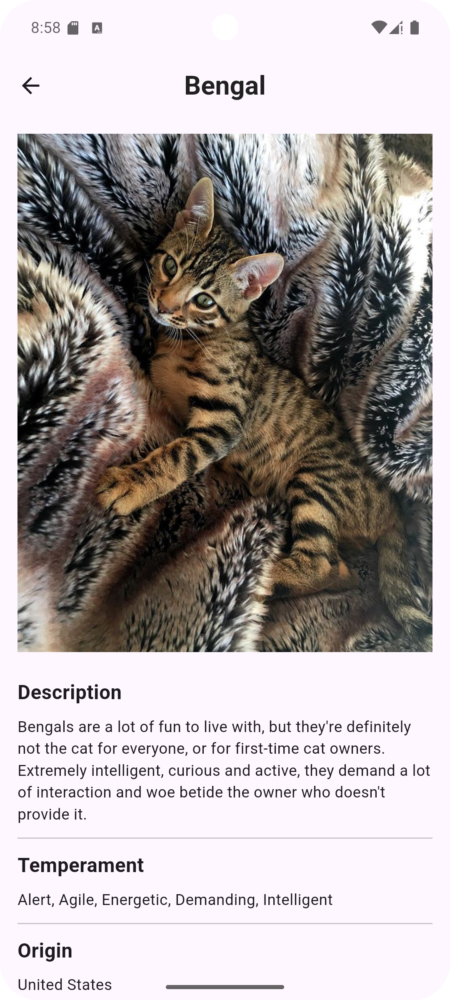
  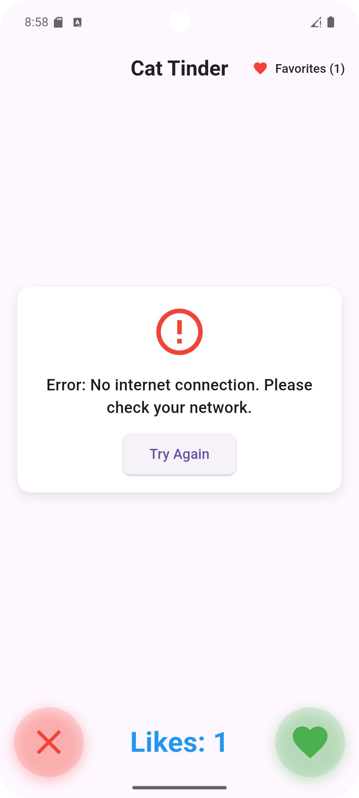
  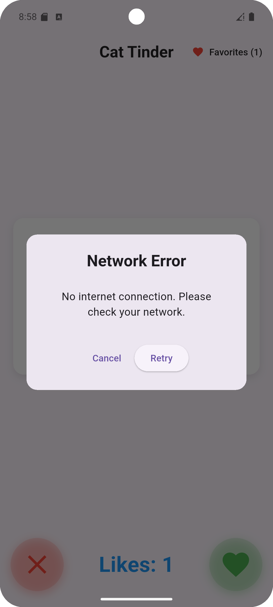
  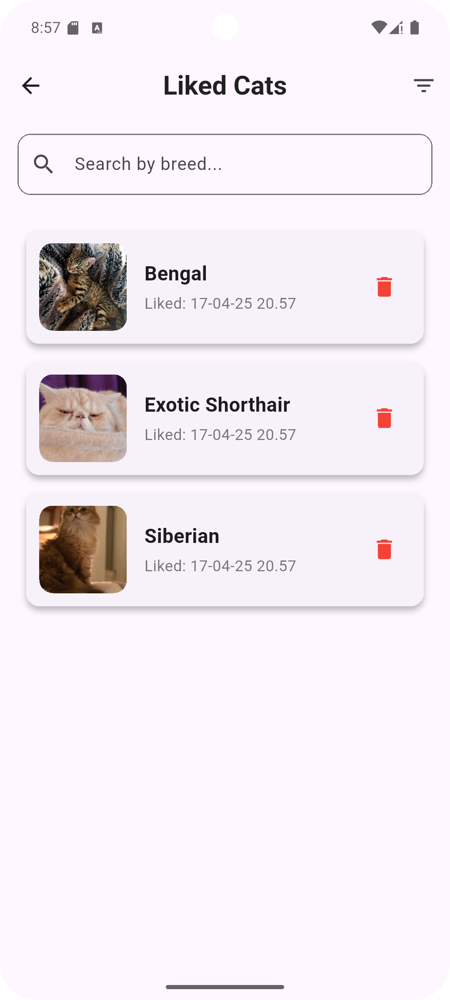
  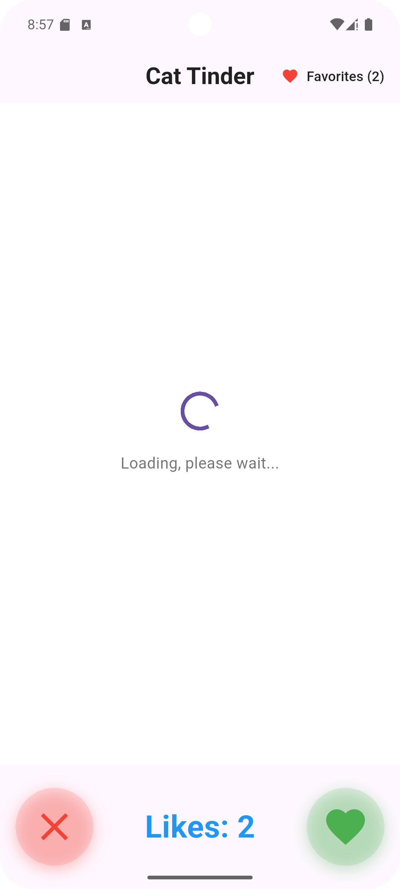
  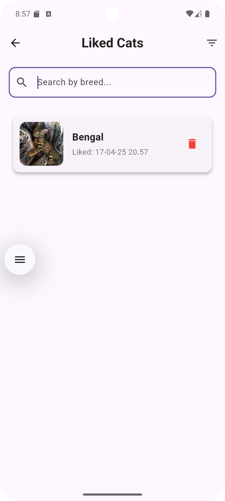
  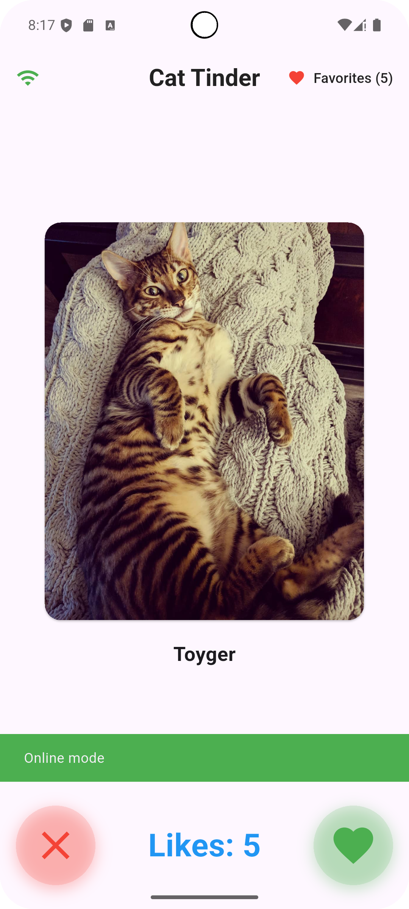
  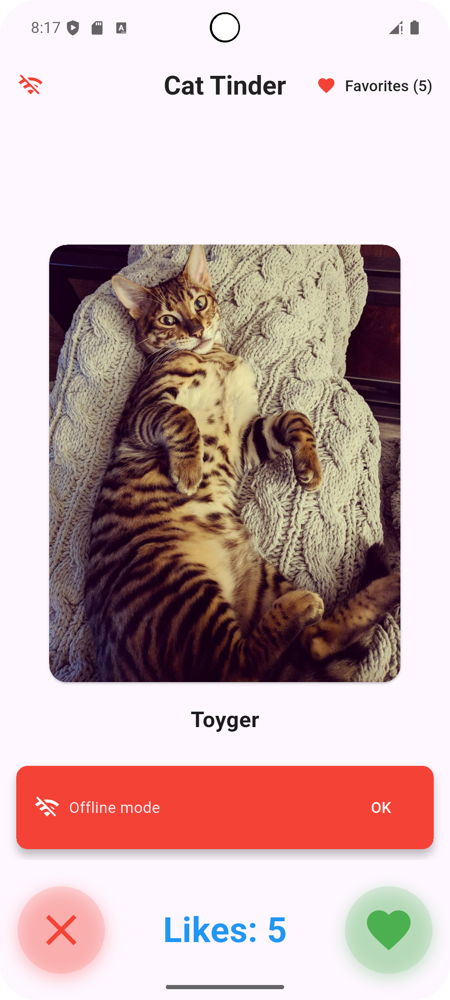
  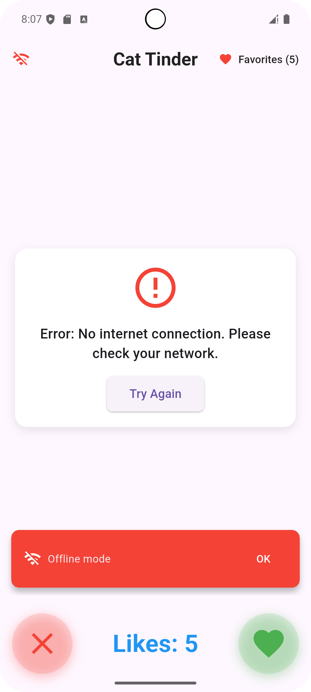
  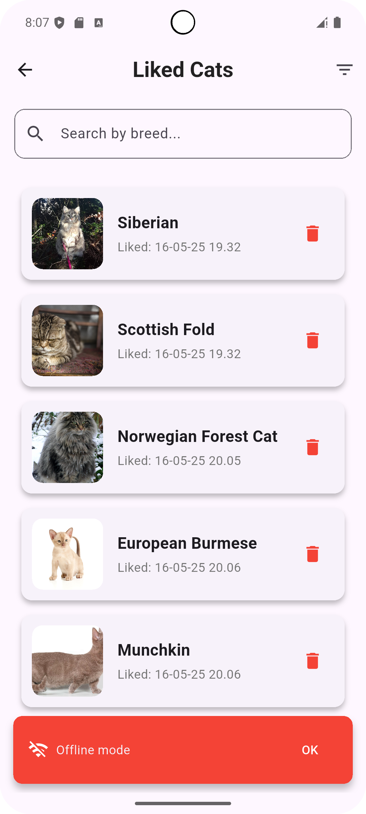

## 🌟 Основные возможности

- **Свайп-система** для быстрого выбора (влево - дизлайк, вправо - лайк)
- **Лайкнутые котики** с историей и фильтрацией
- **Детальная информация** о породах
- **Адаптивный UI** с анимациями
- **Оффлайн-работа** с кешированием изображений
- **Система ошибок** с повтором запросов
- **Локальное хранилище** сохранение понравившихся котов
- **Состояние сети** с использованием SnackBar

## 🚀 Функционал

### Главный экран
- Случайные котики из TheCatAPI
- Интерактивные свайпы
- Кнопки лайк/дизлайк
- Счетчик лайков
- Переход к деталям по тапу

### Экран деталей
- Полная информация о породе
- Характеристики темперамента
- Качественные изображения

### Избранное
- История лайков с датами
- Поиск по породам
- Фильтрация по породам

### Технические фичи
- Прогресс-бары при загрузке
- Диалоги ошибок сети
- Сохранение понравившихся котов в локальное хранилище
- Приложение работает без сети
- Написаны Unit-тесты
- Показывается состояние сети

## 🛠 Технологии

**Архитектура:**
- Clean Architecture (Data-Domain-Presentation)
- Cubit для управления состоянием
- Dependency Injection (get_it)

**Основные пакеты:**
- `http` - работа с API
- `cached_network_image` - кеш изображений
- `flutter_bloc` - state management
- `connectivity_plus` - состояние сети
- `mocktail` - мокирование
